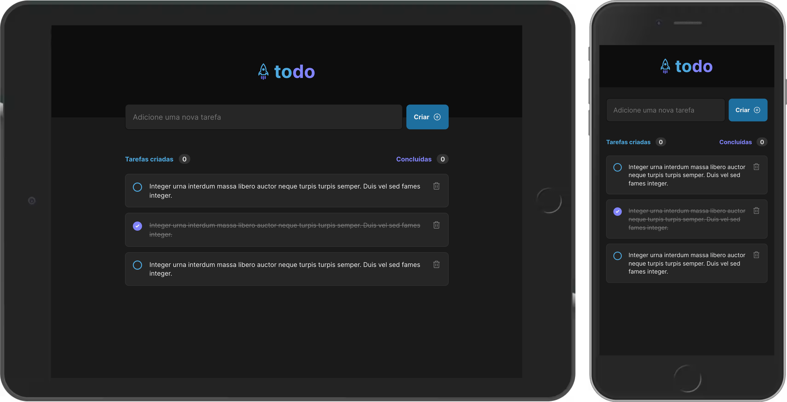

### Projeto Todo List Ignite, desafio da trilha de Fudamentos do ReactJS no curso de ReactJS no Ignite.

#### Tecnologias utilizadas:

- [`ViteJS`](https://vitejs.dev/)
- [`React`](https://reactjs.org)
- [`TypeScript`](https://www.typescriptlang.org/)
- [`SASS`](https://sass-lang.com/)

#### Projeto em desenvolvimento:

- [x] Componentes e Estilo
- [ ] Lógica para o funcionamento do projeto
- [ ] Deploy do projeto
- [ ] Aplicação do projeto

#### Como usar este projeto:

```bash
git clone https://github.com/EduardoAguiarS/todo-list-ignite
```

```bash
cd todo-list-ignite
```

```bash
yarn install
```

```bash
yarn dev
```

#### Projeto:


